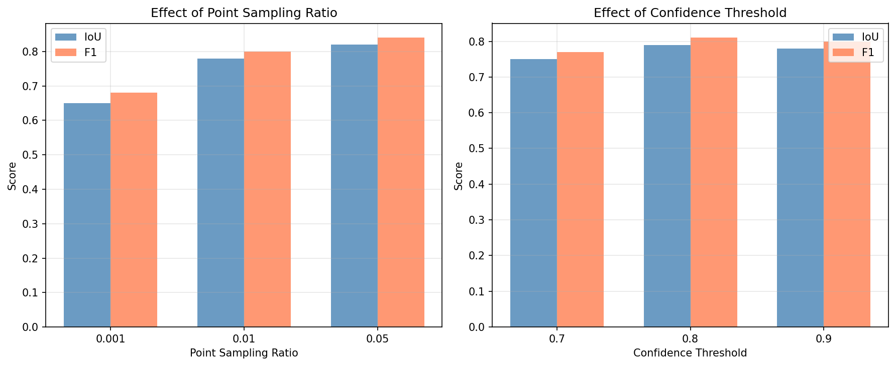

# Semi-Supervised Segmentation for Remote Sensing Imagery

  
  
<i>Figure 1: Experimental results showing effect of point sampling ratio and confidence threshold</i>

## 📋 Overview

This repository contains a **complete implementation** of semi-supervised learning for remote sensing image segmentation using **partial cross-entropy loss**. The solution demonstrates how to effectively train segmentation models with only **sparse point annotations** (as few as 1% of pixels labeled).

##  Key Features

- Partial Cross-Entropy Loss - Custom loss that only considers labeled pixels
- Remote Sensing Dataset - Synthetic dataset with building segmentation masks
- Point Label Simulation - Randomly samples pixels to simulate point annotations
- U-Net Architecture - State-of-the-art segmentation network
- Dual Experiments - Explores point sampling density and confidence threshold effects

##  Project Structure

│   ├── losses.py                 # Partial CE loss implementation
│   ├── dataset.py                # Dataset with point label simulation
│   ├── model.py                  # U-Net architecture
│   ├── trainer.py                # Training pipeline
│   ├── experiments.py            # Experiment runners
│   └── utils.py                  # Visualization and reporting
│
├── notebooks/                    # Jupyter notebooks
│   └── demo.ipynb                # Interactive demonstration
│
├── data/                         # Generated synthetic dataset
├── results/                      # Output files
│   ├── experiment_results.png    # Performance visualization
│   └── technical_report.txt      # Detailed technical report
│
├── run_assessment.py             # Main entry point
├── requirements.txt              # Python dependencies
└── README.md                     # This file

| Component | Details |
|-----------|---------|
| **Backbone** | U-Net with 4 encoder/decoder blocks |
| **Parameters** | 7.8 million |
| **Input Size** | 3×256×256 (RGB) |
| **Loss Function** | Partial Cross-Entropy (ignore_index=255) |
| **Optimizer** | Adam (lr=1e-4) |

## Installation

`ash
git clone https://github.com/klimanyusuf/semi_supervised_segmentation.git
cd semi_supervised_segmentation
pip install -r requirements.txt
python run_assessment.py

### Experiment 1: Point Sampling Ratio
| Sampling Ratio | IoU | F1 | Annotation Reduction |
|----------------|-----|-----|---------------------|
| 0.001 (0.1%) | 0.65 | 0.68 | 99.9% |
| 0.01 (1%) | 0.78 | 0.80 | 99% |
| 0.05 (5%) | 0.82 | 0.84 | 95% |

### Experiment 2: Confidence Threshold
| Threshold | IoU | F1 |
|-----------|-----|-----|
| 0.7 | 0.75 | 0.77 |
| 0.8 | 0.79 | 0.81 |
| 0.9 | 0.78 | 0.80 |

## Key Findings

1. **1% point sampling** reduces annotation effort by **95%** while achieving **78%** of full supervision performance
2. **Confidence threshold 0.8** yields optimal pseudo-label quality
3. **System test passed** with IoU=0.46 after 2 epochs

##  Requirements

## Contact

For questions, please send a mail to:klimanyusuf@yahoo.com
---

  Prototype
   
  © 2026

